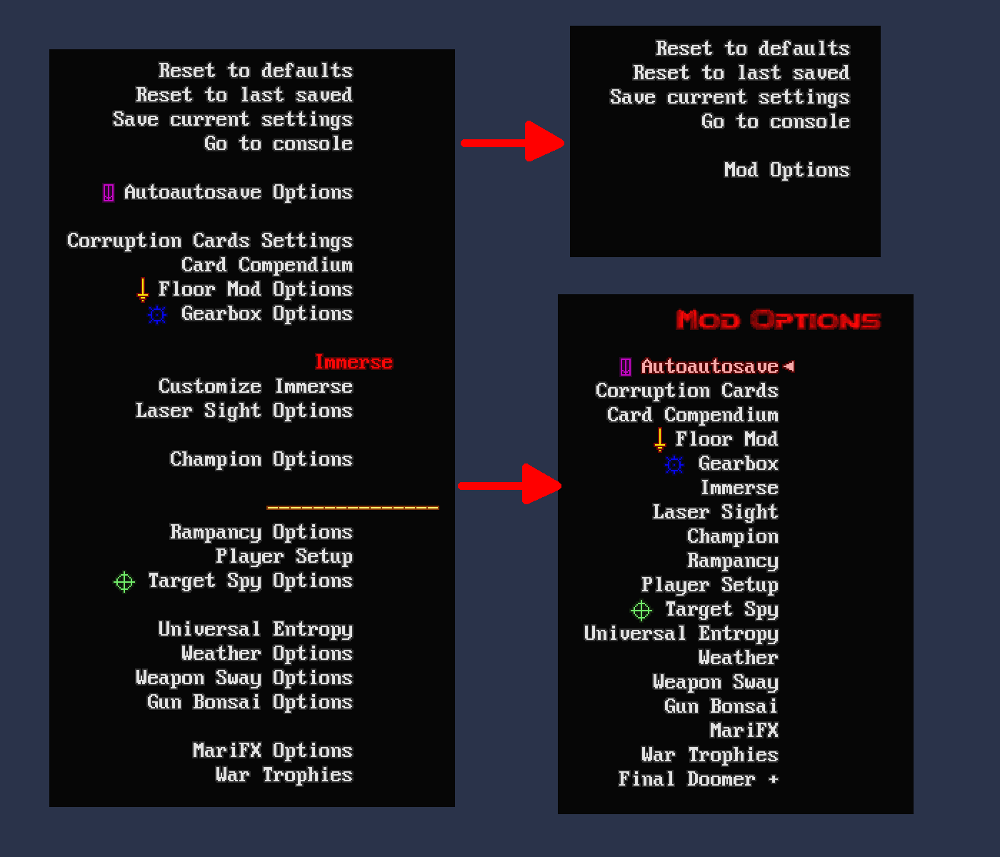

<!--
SPDX-FileCopyrightText: 2022 Alexander Kromm <mmaulwurff@gmail.com>
SPDX-License-Identifier: CC0-1.0
-->

# Mod Menu

This GZDoom add-on puts every mod options menu into the special Mod Menu instead
of cluttering Options Menu.

## Features

- Moves all extra submenus from Options Menu to Mod Menu.
- Adds Mod Menu to simplified Options Menu.
- Has a chance to put Zandronum-style keybind-only-accessible menus to Mod Menu.
- A key to open Mod Menu.

## Limitations

- mod menu detection expects that the first two MENUDEF lumps in the engine
  package are lumps for the full and the simple option menus.
- Zandronum-style menus are detected by scanning Controls menu for anything
  with a command containinng "open" and "menu".

## Acknowledgments

- Thanks to mamaluigisbagel for bug reports.
